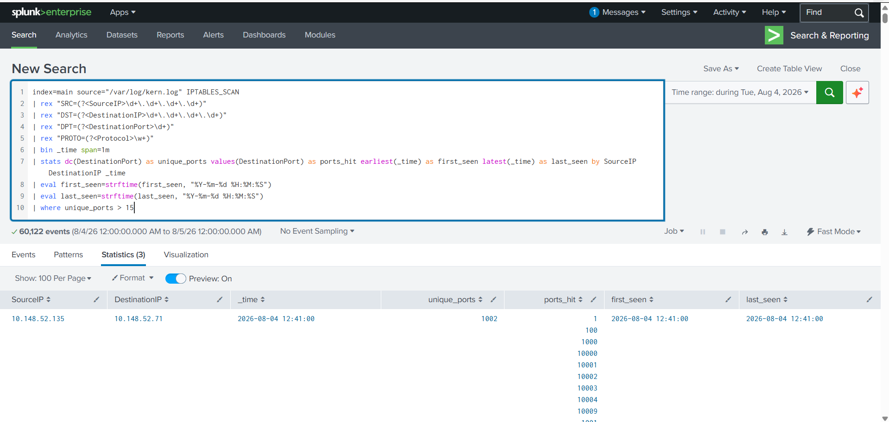
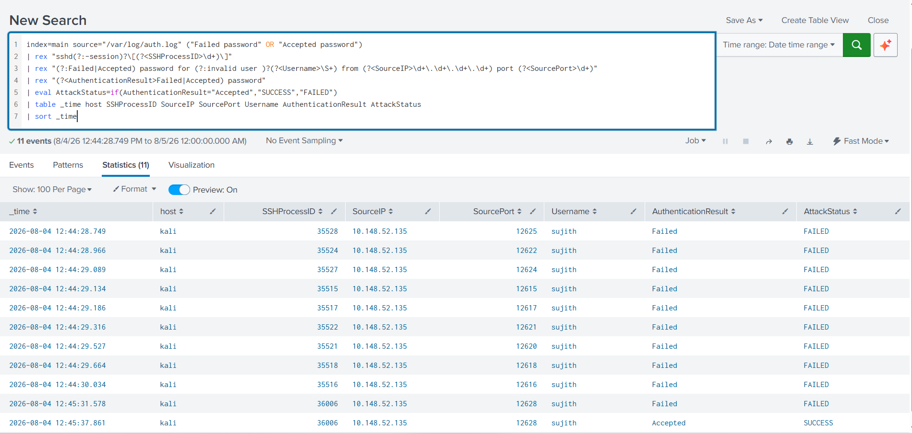
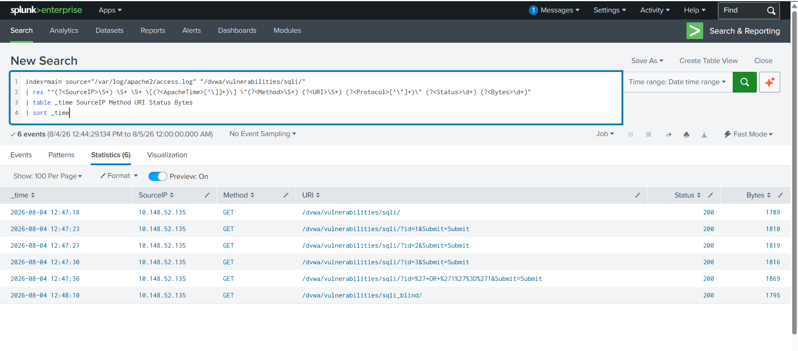
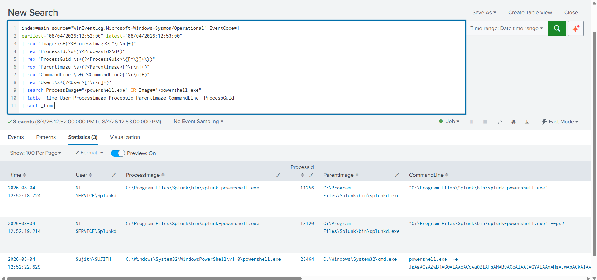
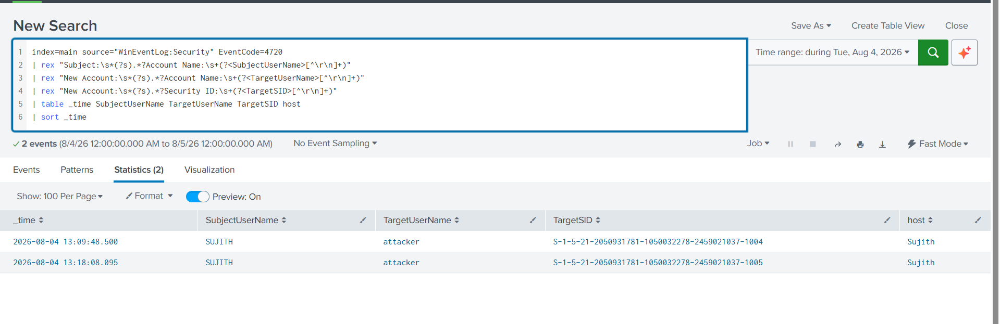
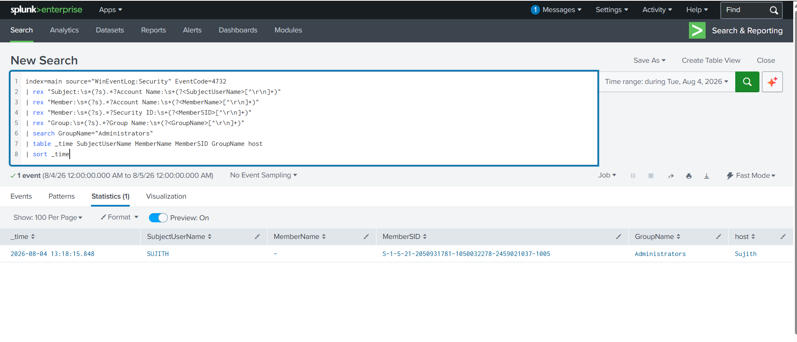
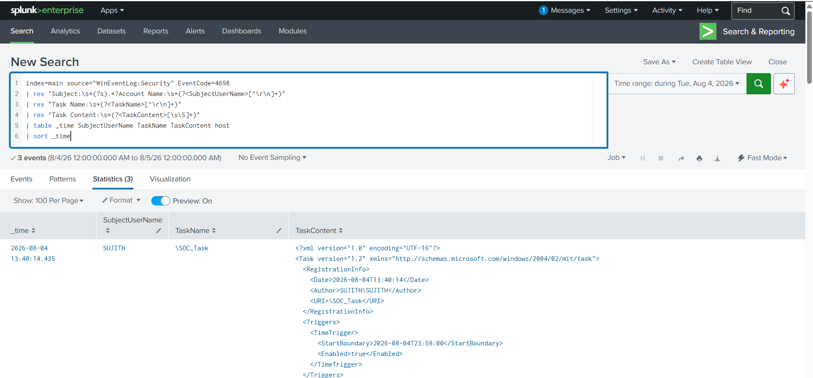

# SOC Home Lab — Detection Engineering & Incident Analysis

> Hands-on SOC home lab using Splunk Enterprise to ingest multi-source security telemetry, develop SPL detections, correlate attack activity, map events to MITRE ATT&CK, and reconstruct an incident timeline.

---

## 🎯 Project Overview

This project simulates a SOC investigation workflow using an isolated cybersecurity home lab.

The objective was to generate attack telemetry, ingest the resulting logs into Splunk Enterprise, develop detections using SPL, correlate related events, map activity to MITRE ATT&CK techniques, and investigate the resulting attack sequence.

The project focuses on the workflow followed by a SOC analyst:

**Telemetry → Detection → Correlation → Investigation → MITRE Mapping → Incident Analysis → Response**

---

## 🔍 Project Focus

- Splunk Enterprise and SPL
- Detection engineering
- Linux log analysis
- Windows Security Event analysis
- Sysmon process telemetry
- Firewall / iptables telemetry
- MITRE ATT&CK mapping
- Event correlation
- Incident timeline reconstruction
- IOC identification
- SOC triage and response

---

## 🧪 Lab Stack

| Technology / Tool | Purpose |
|---|---|
| Splunk Enterprise | SIEM, log ingestion, search and detection |
| Kali Linux | Attack simulation and security testing |
| Nmap | Network service discovery |
| Hydra | SSH brute-force simulation |
| Apache2 | Web-server telemetry |
| DVWA | Intentionally vulnerable web application |
| Sysmon | Windows process telemetry |
| Windows Security Logs | Authentication, account and persistence events |
| iptables | Network/firewall telemetry |
| Atomic Red Team | Controlled adversary simulation |

---

## 🏗️ Lab Architecture

The lab consists of simulated attack sources, monitored endpoints, security telemetry and Splunk-based investigation.

    Kali Linux
    ├── Nmap
    ├── Hydra
    └── Web Testing
            |
            | Attack Activity
            v
    Linux / DVWA
    ├── Apache2
    ├── auth.log
    └── kern.log
            |
            | Security Telemetry
            v
    Windows Endpoint
    ├── Sysmon
    └── Windows Security Logs
            |
            | Security Telemetry
            v
    Splunk Enterprise
    ├── SPL Detection
    ├── Event Correlation
    └── Investigation

---

## ⚔️ Simulated Attack Chain

| # | Activity | MITRE ATT&CK | Primary Evidence |
|---|---|---|---|
| 1 | Nmap Port Scan | T1046 — Network Service Discovery | iptables / kern.log |
| 2 | SSH Brute Force | T1110.001 — Password Guessing | auth.log |
| 3 | SQL Injection against DVWA | T1190 — Exploit Public-Facing Application | Apache access.log |
| 4 | Encoded PowerShell | T1059.001 — PowerShell | Sysmon Event ID 1 |
| 5 | Local Account Creation | T1136.001 — Local Account | Windows Security Event ID 4720 |
| 6 | Add Account to Administrators | T1098.007 — Additional Local or Domain Groups | Windows Security Event ID 4732 |
| 7 | Scheduled Task Creation | T1053.005 — Scheduled Task | Windows Security Event ID 4698 |

---

## 🛡️ Detection Scenarios

### 1. Network Service Discovery

Nmap scanning activity was detected through firewall/iptables telemetry.

**Evidence Source:** `kern.log / iptables`

**MITRE ATT&CK:** `T1046 — Network Service Discovery`

### Evidence

---

### 2. SSH Brute Force

The lab identified seven failed SSH authentication attempts followed by a successful authentication from the same Kali source.

**Evidence Source:** `auth.log`

**MITRE ATT&CK:** `T1110.001 — Password Guessing`

### Evidence

---

### 3. SQL Injection

SQL injection activity was investigated against the intentionally vulnerable DVWA application.

**Evidence Source:** `Apache access.log`

**MITRE ATT&CK:** `T1190 — Exploit Public-Facing Application`

### Evidence

---

### 4. Encoded PowerShell

Sysmon captured the following process execution pattern:

`cmd.exe → powershell.exe -EncodedCommand`

The process lineage and command line provided useful evidence for investigating suspicious PowerShell execution.

**Evidence Source:** `Sysmon Event ID 1`

**MITRE ATT&CK:** `T1059.001 — PowerShell`

### Evidence

---

### 5. Local Account Creation

A local account creation event was detected using Windows Security Event ID 4720.

**Evidence Source:** `Windows Security Event ID 4720`

**MITRE ATT&CK:** `T1136.001 — Local Account`

### Evidence

---

### 6. Administrator Group Modification

A local account creation event was followed seven seconds later by a privileged local-group membership change using Event ID 4732.

This creates a high-value correlation opportunity for detecting suspicious privilege escalation.

**Evidence Source:** `Windows Security Event ID 4732`

**MITRE ATT&CK:** `T1098.007 — Additional Local or Domain Groups`

### Evidence

---

### 7. Scheduled Task Creation

Windows Security Event ID 4698 captured creation of:

`\SOC_Task`

The task XML and trigger information were preserved so the analyst could investigate the actual task action.

**Evidence Source:** `Windows Security Event ID 4698`

**MITRE ATT&CK:** `T1053.005 — Scheduled Task`

### Evidence

---

## 🔗 Detection Correlation

One of the key objectives of this project was to demonstrate that a SOC analyst should not investigate every event independently.

A key correlation example is the relationship between local account creation and administrator group modification.

    Account Creation
           |
           | Event ID 4720
           v
    New Local Account
           |
           | 7 seconds later
           v
    Administrator Group Modification
           |
           | Event ID 4732
           v
    Potential Privilege Escalation

This type of correlation provides stronger investigative context than treating each event as an isolated alert.

---

## 📊 Evidence Integrity

The Kali source:

`10.148.52.135`

is directly evidenced for the Nmap, SSH and DVWA activity.

The Windows execution, account and persistence events are supported independently by Sysmon and Windows Security telemetry.

The available evidence does **not** independently prove a network-level pivot from Kali/DVWA to Windows.

Therefore, this project deliberately avoids making an unsupported claim about a Kali-to-Windows pivot.

This demonstrates an important SOC investigation principle:

> **Separate directly observed evidence from assumptions or simulated attack narrative.**

---

## 🔎 Detection Engineering Opportunities

The lab provides opportunities to develop detections for:

- Repeated SSH authentication failures followed by successful login
- High-rate network port scanning
- Suspicious PowerShell execution
- Encoded PowerShell commands
- Suspicious process lineage
- Local account creation
- Privileged group membership changes
- Account creation followed by privilege escalation
- Suspicious scheduled-task creation
- Network and DNS indicators associated with future C2 activity
- Large outbound data transfers for future exfiltration simulations

---

## 📈 SOC Investigation Workflow

    1. Alert / Detection
             |
             v
    2. Validate the Event
             |
             v
    3. Identify Source & Destination
             |
             v
    4. Analyze Related Events
             |
             v
    5. Build Timeline
             |
             v
    6. Map to MITRE ATT&CK
             |
             v
    7. Determine Impact
             |
             v
    8. Recommend Response
             |
             v
    9. Document Findings

---

## 🧰 Skills Demonstrated

### SIEM & Detection

- Splunk Enterprise
- SPL
- Log ingestion
- Search optimization
- Detection logic
- Event correlation

### Security Monitoring

- Linux authentication logs
- Apache access logs
- iptables telemetry
- Windows Security Events
- Sysmon telemetry

### Threat Detection

- Network scanning
- Brute-force activity
- Web attack activity
- PowerShell execution
- Account creation
- Privilege escalation indicators
- Persistence indicators

### Investigation

- IOC identification
- Event correlation
- Timeline reconstruction
- MITRE ATT&CK mapping
- Evidence-based analysis
- SOC triage

---

## 📁 Repository Structure

    SOC-Home-Lab-Detection-Engineering/
    |
    ├── README.md
    |
    ├── screenshots/
    |   ├── 01-nmap-port-scan.png
    |   ├── 02-ssh-brute-force.png
    |   ├── 03-sql-injection.png
    |   ├── 04-powershell-detection.png
    |   ├── 05-account-creation.png
    |   ├── 06-admin-group-change.png
    |   └── 07-scheduled-task.png
    |
    ├── report/
    |   └── SOC_Home_Lab_Report.pdf
    |
    └── spl/
        └── Detection queries

---

## 📄 Project Report

The detailed methodology, investigation evidence and assessment results are documented in the project report.

The complete report is available in the `report/` directory of this repository.

---

## 🚀 Future Improvements

The project will be continuously expanded as the SOC lab evolves.

### Phase 1 — Detection Engineering

- Enable Sysmon Event ID 3
- Add DNS telemetry
- Improve field extraction
- Create scheduled Splunk alerts
- Add risk-based alert prioritization

### Phase 2 — Threat Hunting

- Develop hypothesis-driven hunts
- Add suspicious PowerShell hunting
- Hunt for lateral-movement indicators
- Investigate persistence techniques
- Add network-based hunting

### Phase 3 — SOC Platform Expansion

- Integrate Wazuh
- Integrate Microsoft Sentinel
- Compare detection capabilities across SIEM platforms
- Build centralized investigation workflows

### Phase 4 — AI for SOC

- AI-assisted alert triage
- Automated event summarization
- Detection-rule assistance
- Investigation timeline generation
- Threat-intelligence enrichment

---

## 🎓 Project Outcome

This project provided practical experience in moving from:

**Attack Activity → Security Telemetry → Detection → Correlation → Investigation → MITRE Mapping → Response**

The lab demonstrates practical SOC Analyst skills rather than only theoretical knowledge.

---

## ⚠️ Disclaimer

This project was performed in an isolated, intentionally vulnerable home-lab environment for cybersecurity learning and defensive detection engineering.

No unauthorized systems were targeted.

---

## 👤 Author

**G Sujith**

Cybersecurity / SOC Analyst Candidate
